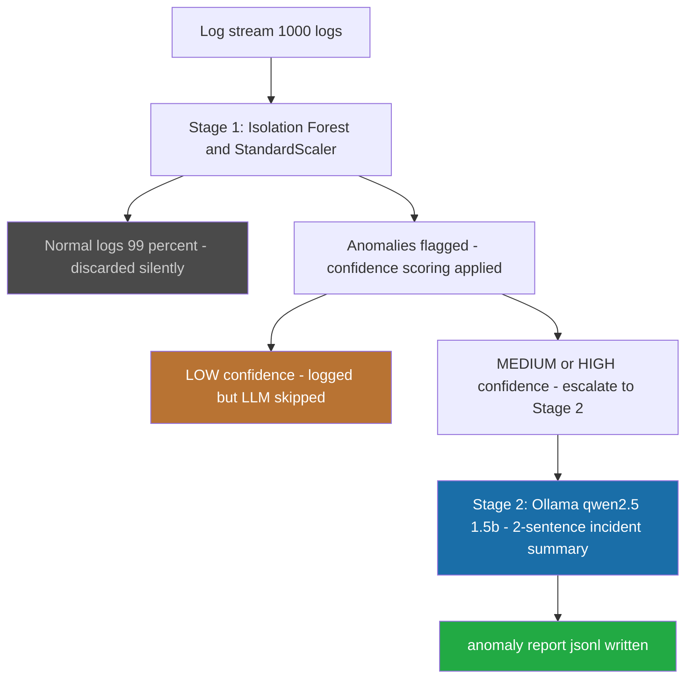

# Local Log Anomaly Analyzer

Local Log Anomaly Analyzer — two-stage pipeline that filters system logs with ML and escalates genuine anomalies to a local LLM for incident summaries. No cloud. No GPU. Runs on 8GB RAM.

## Problem
Production systems generate thousands of log lines per second. Sending every log to an LLM for analysis is financially unviable — at scale, the cost is prohibitive. Cloud-based log analysis tools require sending potentially sensitive infrastructure data to external servers.

The gap: no lightweight, offline tool exists that combines fast ML filtering with LLM-quality incident summaries, running entirely on local hardware.

## Architecture


## Confidence scoring system
The pipeline uses Isolation Forest raw anomaly scores to create three confidence tiers:

- `HIGH` (`score < -0.22`): severe anomaly — always escalated to LLM.
- `MEDIUM` (`score -0.22 to -0.16`): moderate anomaly — escalated.
- `LOW` (`score > -0.16`): borderline anomaly — logged but LLM skipped.

Why this matters:
- Calling the LLM for every flagged anomaly wastes compute.
- A borderline anomaly that barely crossed the detection threshold does not need a full LLM analysis.
- The confidence filter saves LLM calls without losing important signals.

Engineering insight:
- Isolation Forest scores reflect how isolated a point is relative to the rest of the dataset.
- Once a log is flagged, even mild anomalies score below `-0.13` because they are genuinely the most unusual points in the dataset.
- The thresholds were set empirically from real score distributions, not arbitrarily.

## Verified local test output
```text
Isolation Forest training time: 393.22 ms
Flagged anomaly scores -> min: -0.2784, max: -0.1388, mean: -0.2287
[anomaly 1] score=-0.2196 confidence=MEDIUM service=api-gateway
[anomaly 2] score=-0.2273 confidence=HIGH service=auth-service
[anomaly 3] score=-0.1587 confidence=LOW service=api-gateway
[anomaly 4] score=-0.2284 confidence=HIGH service=payment-service
[anomaly 5] score=-0.2784 confidence=HIGH service=payment-service
[anomaly 6] score=-0.1388 confidence=LOW service=auth-service
[anomaly 7] score=-0.2218 confidence=HIGH service=payment-service
[anomaly 8] score=-0.2656 confidence=HIGH service=cache
[anomaly 9] score=-0.2772 confidence=HIGH service=payment-service
[anomaly 10] score=-0.2714 confidence=HIGH service=cache
```

## Real report sample
### HIGH confidence example
```json
{
  "timestamp": "2026-07-12T...",
  "service": "payment-service",
  "level": "CRITICAL",
  "confidence": "HIGH",
  "anomaly_score": -0.2784,
  "escalated_to_llm": true,
  "llm_summary": "The anomaly indicates a critical issue with the payment service experiencing high CPU utilization and elevated error counts. Investigate the payment processing queue and recent deployment changes immediately.",
  "log_data": {...}
}
```

### LOW confidence example
```json
{
  "service": "api-gateway",
  "confidence": "LOW",
  "anomaly_score": -0.1587,
  "escalated_to_llm": false,
  "llm_summary": null
}
```

## Performance dashboard
- Stage 1 throughput: 1865 logs/sec
- Stage 2 escalation rate: 80%
- LLM calls saved: 2
- Average LLM response time: 17874ms
- Most affected service: payment-service (4 anomalies)

## Engineering decisions
- Isolation Forest over deep learning: no labeled data needed, trains in under 400ms, runs entirely in memory, zero external dependencies.
- StandardScaler before fitting: response_time_ms ranges 50-15000 while cpu_percent ranges 20-100 — without scaling, the high-magnitude features dominate the model unfairly.
- Confidence-based escalation over calling LLM for everything: 20% of flagged anomalies were borderline and didn't need LLM analysis — the confidence filter saved those calls without missing any HIGH or MEDIUM severity events.
- Local Ollama over cloud LLM API: infrastructure logs contain sensitive service names, IP patterns, and error details — keeping inference local means that data never leaves the machine.

## Quick start
Prerequisites:
- Python 3.10+
- Ollama installed from ollama.com
- 8GB RAM minimum

Setup:
```bash
git clone https://github.com/muhammadnsererko/local-log-analyzer
cd local-log-analyzer
pip install -r requirements.txt
ollama pull qwen2.5:1.5b
python main.py
```

## File structure
- `log_generator.py` — generates 1000 synthetic logs with three tiers of injected anomalies (severe, moderate, mild)
- `analyzer.py` — two-stage pipeline: Isolation Forest filter with confidence scoring + Ollama LLM escalation
- `main.py` — entry point, prints performance dashboard and summary

## Hardware
Built and tested on Windows 11, 8GB RAM, no GPU. Ollama runs qwen2.5:1.5b on CPU only.
